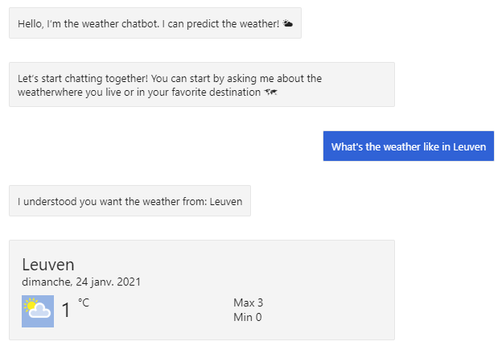

# Chatbot workshop
This repository has been created for the chatbot workshop about chatbots, and specifically the Bot Framework v4 from Microsoft.

For any question about the workshop, please contact [me at amelie.lemal@realdolmen.com](mailto:amelie.lemal@realdolmen.com).

## Tools needed

**To Install/Have on your computer:**

- Visual Studio 2017 or 2019
- Latest version of the Bot Emulator: [here](https://github.com/Microsoft/BotFramework-Emulator/releases)
- Download the template project: [here](https://github.com/shamely/weather-bot)
- _(Optional)_ Templates for Bot Framework v4: [here](https://marketplace.visualstudio.com/items?itemName=BotBuilder.botbuilderv4)

**Accounts to create:**

- Get a student account on [Azure](https://azure.microsoft.com/en-us/free/students/) and create a free LUIS resource via [Luis.ai](https://www.luis.ai/)
- Create a free account on [WeatherStack](https://weatherstack.com/)

## Workshop theme
We are going to create a bot to get the **current weather** in some places. The bot is going to understand a user asking for the weather through different formulations, grab the place the user is talking about and display a card showing different information from the API.

Goal of this session:

- Learn about chatbot and the basic concepts
- Learn how to create a simple chatbot with Microsoft tools
- The NLP services at your disposal
- Be able to research more about the topic and understand what you read

[Start the workshop with some theory](https://github.com/shamely/weather-bot/wiki/Workshop---Theory)
